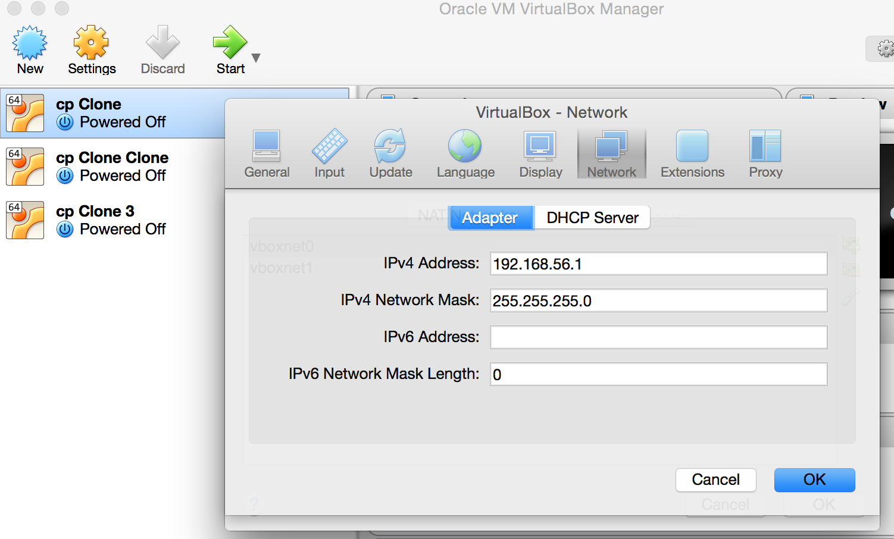
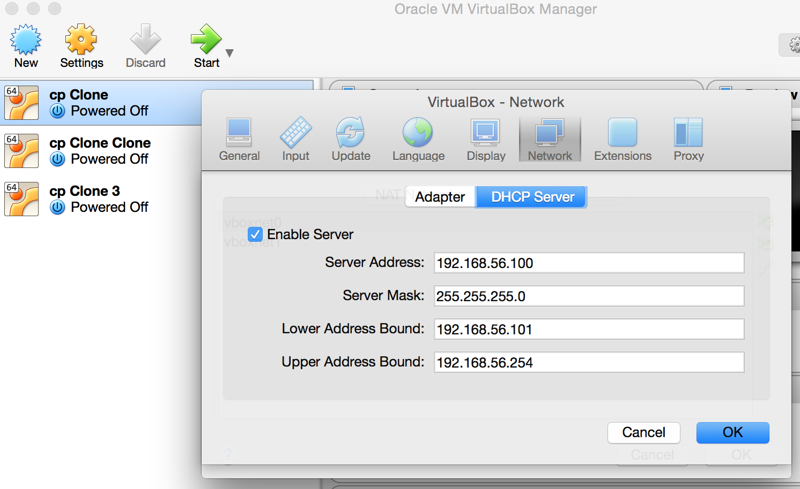

# Network Scanning Practical: Setup
In time this will be on the virtual machine. For now there's just a few things to do before you start.

**This uses Python 3.**

## Python Package Installation
```
pip3 install cp_ftp/
```

## Run the documentation server
```
./run.sh
```

Leave this running in the background. `CTRL+C` will kill it and all the child processes when you're done.

## Install the Virtual Machines
Decompress `netscan-vm.ova.xz`. That's compressed by `xz`, something `OS X` supports natively and available
for other platforms.

There is a single Virtual Machine image provided as `netscan-vm`. Double-click `netscan-vm/netscan-vm.ovf` to import it in VirtualBox. Import that image 3 times, making 3 Virtual Machines. **It is essential that when importing you tick to `Reinitialise the MAC Address of all network cards`.**

Those 3 VMs then need to be running on the following 3 IP Addresses. It doesn't matter which is which, they're identical, just that these IP Addresses are used by something.

* One VM on 192.168.56.101
* One VM on 192.168.56.102
* One VM on 192.168.56.103

The easiest way to achieve this is by configuring a Host-only Adapter in VirtualBox with the following
settings. If these images aren't visible, open `virtualbox-vboxnet0-settings-adapter.png` and `virtualbox-vboxnet0-settings-dhcp.png`.




Once you create that Host-Only Adapter in Virtualbox's global settings, you need to:

* Open Settings > Network for each individual Virtual Machine.
* Set its Host-only Adapter to the network you've just created.

Start all 3 Virtual Machines. You may need to shut them down and start them a second time for IP Addresses to start working correctly.

## Get started
Go to [The Documentation](http://localhost:3000).
